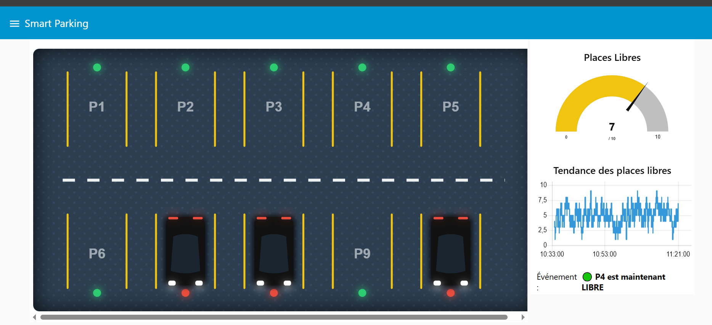

<div align="center">

# 🚗 Smart Parking System
### Real-Time IoT Monitoring & Control Dashboard


</div>

---

## 📌 Description

Ce projet consiste à concevoir un **système de parking intelligent** permettant de gérer et de surveiller en temps réel l'occupation de plusieurs places de stationnement.

L'élément central de l'architecture est le protocole de communication **MQTT**, utilisé pour assurer une transmission légère et instantanée des données entre les capteurs de présence (simulés par un script Python) et le serveur.

L'interface utilisateur est une **visualisation SVG interactive d'un parking**, intégrée directement dans le tableau de bord Node-RED, qui reflète instantanément l'arrivée et le départ des véhicules. Elle est complétée par une jauge de capacité globale, un historique graphique d'occupation et des alertes de sécurité en cas de parking complet.

---

## 🖥️ Aperçu du Dashboard



> *Le dashboard en action : places libres (LED verte), places occupées (voiture avec feux rouges), jauge de disponibilité et graphique temps réel.*

---

## 🏗️ Architecture du Système

```
┌─────────────────┐     MQTT Publish      ┌──────────────────────┐     Subscribe     ┌─────────────────────┐
│                 │   parking/P1...P10    │                      │   parking/#       │                     │
│  simulator.py   │ ─────────────────────►│  Mosquitto Broker    │──────────────────►│     Node-RED        │
│  (Capteurs IoT) │   parking/available   │  localhost:1883      │                   │  (Dashboard + SVG)  │
│                 │ ─────────────────────►│                      │                   │                     │
└─────────────────┘                       └──────────────────────┘                   └─────────────────────┘
```

| Composant | Rôle | Technologie |
|-----------|------|-------------|
| **Simulateur Python** | Simule les capteurs IoT des places | Python + `paho-mqtt` |
| **Broker MQTT** | Achemine les messages en temps réel | Eclipse Mosquitto |
| **Node-RED** | Traite, visualise et alerte | Node-RED + `node-red-dashboard` |

---

## 📡 Topics MQTT

| Topic | Description | Payload Exemple |
|-------|-------------|----------------|
| `parking/P1` | État de la place 1 | `{"state": "free", "slot": "P1"}` |
| `parking/P2` | État de la place 2 | `{"state": "occupied", "slot": "P2"}` |
| `...` | ... | ... |
| `parking/P10` | État de la place 10 | `{"state": "free", "slot": "P10"}` |
| `parking/available` | Nombre de places libres | `7` |

---

## ⚙️ Fonctionnement du Flux Node-RED

Le flux Node-RED est organisé en **4 traitements principaux** :

1. **📥 Réception MQTT** — Node-RED s'abonne au topic `parking/#` et reçoit chaque événement instantanément dès qu'une place change d'état a cause du script pythone qui mettre ajours les etats a chaque 5s.

2. **🗺️ Interface SVG Dynamique** — Un nœud `ui_template` met à jour en temps réel le dessin SVG du parking : les voitures apparaissent/disparaissent avec une animation fluide et les LED changent de couleur (🟢 Libre / 🔴 Occupée).

3. **📊 Statistiques Visuelles** — Une **jauge** (`ui_gauge`) affiche le nombre de places libres avec un code couleur (vert → rouge). Un **graphique** (`ui_chart`) trace l'historique de l'occupation dans le temps.

4. **🚨 Alertes & Logs** — Un nœud `Switch` surveille en continu la disponibilité. Si le parking est **complet** (`available == 0`), une notification `Toast` rouge est déclenchée automatiquement. Un historique textuel des événements est également affiché.

---

## 📦 Structure du Projet

```
SmartParkingSystem/
│
├── 📄 simulator.py              # Script Python - Simulation des capteurs IoT
├── 📋 smart_parking_flow.json   # Flow Node-RED complet (à importer)
├── 📖 README.md                 # Documentation du projet
└── 📁 docs/
    └── 🖼️ dashboard.png         # Capture d'écran du dashboard
```

---

## 🛠️ Installation & Démarrage

### Prérequis
- [Python 3.8+](https://www.python.org/downloads/)
- [Node.js + Node-RED](https://nodered.org/docs/getting-started/windows)
- [Eclipse Mosquitto](https://mosquitto.org/download/)

### Étape 1 — Démarrer le Broker Mosquitto
```bash
mosquitto -v -c "C:\Program Files\mosquitto\mosquitto.conf"
```
> ⚠️ Vérifiez que `allow_anonymous true` est activé dans `mosquitto.conf`

### Étape 2 — Installer les dépendances Python
```bash
pip install paho-mqtt
```

### Étape 3 — Importer le Flow dans Node-RED
1. Lancez Node-RED : `node-red`
2. Ouvrez `http://localhost:1880` dans votre navigateur
3. Installez le module `node-red-dashboard` via `☰ > Manage palette > Install`
4. Importez `smart_parking_flow.json` via `☰ > Import > Select a file`
5. Cliquez sur **Déployer** 🔴

### Étape 4 — Lancer la Simulation
```bash
python simulator.py
```

### Étape 5 — Ouvrir le Dashboard
👉 **[http://localhost:1880/ui/](http://localhost:1880/ui/)**

---

## 🎯 Fonctionnalités

- [x] 🗺️ Vue SVG interactive du parking (vue aérienne)
- [x] 🚗 Voitures animées qui apparaissent/disparaissent en temps réel
- [x] 🟢🔴 Capteurs LED colorés par place (Libre/Occupée)
- [x] 📊 Jauge globale de disponibilité (0–10 places)
- [x] 📈 Graphique historique de l'occupation
- [x] 🚨 Alerte automatique "Parking Complet"
- [x] 📝 Log temps réel des événements

---

## 🧪 Technologies Utilisées

| Technologie | Version | Usage |
|-------------|---------|-------|
| Python | 3.8+ | Simulation des capteurs |
| paho-mqtt | 2.1.0 | Client MQTT Python |
| Mosquitto | 2.x | Broker MQTT local |
| Node-RED | 3.x | Orchestration & Dashboard |
| node-red-dashboard | 3.x | Interface utilisateur web |
| SVG + AngularJS | — | Visualisation interactive |

---

<div align="center">

*Projet IoT Universitaire — Smart Parking System*

</div>
